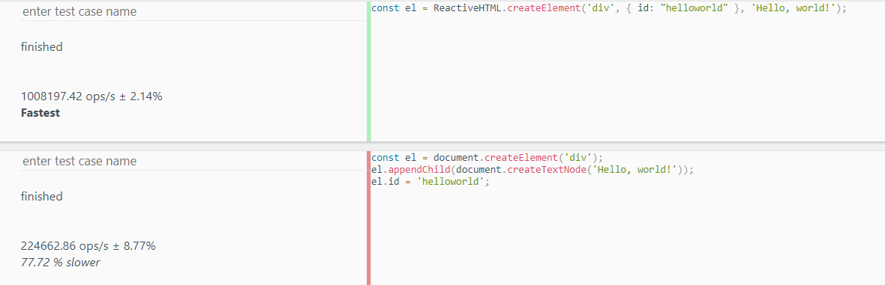

# ReactiveHTML
Simple reactive Virtual DOM elements for building complex reactive UI

## Download
```
npm i reactivehtml
```

## HTM.js cdn
```
https://cdnjs.com/libraries/htm
```

## lit html
I also recommend to install lit html extension in visual studio code to highlight your elements inside string
```
bierner.lit-html
```

## Compatibility
Only browsers that supports ES8 (classes, proxies, Object.entries, Object.values)

## About
This library allows you to write components with html elements in javascript, so you can create conditional rendering or
list rendering simply.

The library has reactive state management, that means elements can react on your input (variables) and you don't have to
use dom api over your application.

Every change in components are done in virtual dom.

Virtual dom is lightweight copy of real dom, virtual dom is json javascript object, that means every diffing are faster
than in real dom, because real dom need to recalculate styles, parents,... 



This library is also very lightweight, only 2Kb min+gzip

## Hello world
```
/* this example is create with htm.js */
const html = htm.bind(ReactiveHTML.createElement);

ReactiveHTML.elementReady('#app', el => ReactiveHTML.render(html`<div>Hello, world!</div>`, el));
```

note: every example are done with htm.js for clarity

## render method
This method render virtual dom into real dom and mount it to specific element.

```
ReactiveHTML.render(html`<div>Hello, world!</div>`, document.getElementById('app'));
```

## elementReady method
This method wait until selector in the first parameter matched element.
Element is matched before whole DOM is loaded, it is matched after element was parsed.
That means you can modify element before whole DOM loaded, so if it is some big modification, user don't see "blick" effect.

If element was matches, it will call asynchronnous callback function in second parameter, where you can render to this element.
Callback function paramater is the matched element.

Note: call elementReady before element in document, else callback function will never be called.
```
ReactiveHTML.elementReady('#app', function(element){

    console.log(element);
    ReactiveHTML.render(html`<div>Hello, world!</div>`, element);

});
```

## createElement method
This method creates virtual element.
It has 3 parameters, first one is String or Class of component. It defining type of virtual element.
Second parameter is Object that are props/attributes.
The last one is unlimited parameter. In this parameter can be children virtual nodes.

This method can be replaced with html literal string tag function.

```
ReactiveHTML.createElement('div', { id: "hello-world" }, 'Hello, world!');
html`<div id="hello-world">Hello, world!</div>`
```

This two virtual Elements are the same.

To make html function you have to installed htm.js library and bind its function to ReactiveHTML.createElement

```
const html = htm.bind(ReactiveHTML.createElement);
```

## createFactory method
This method creates fuction which can be called as component element.
This method has one parameter that is the component class.
On call factory function the first parameter is Object - props of component.

```
class myComponent extends ReactiveHTML.Component {

    Element(props, states) {

        return html`<div>${ props.message }</div>`

    }

}

const myComponentFactory = ReactiveHTML.createFactory(myComponent);

ReactiveHTML.render(myComponentFactory({ message: "Hello, world!" }), document.getElementById('app'));

```

## Components

### Element method
Element method is the only one method, that have to be defined else it will throw Error.

### Simple component

this example with component has the same output as the Hello world example, but with component based elements

```
class HelloWorldComponent extends ReactiveHTML.Component {

    Element(props, states) {

        return html`<div>Hello, world!</div>`

    }

}

ReactiveHTML.elementReady('#app', el => ReactiveHTML.render(html`<${ HelloWorldComponent } />`, el));
```

### Component Factory
if you don't like element based component write, you can create factory of class and you can use component as function

```
const HelloWorldComponent = ReactiveHTML.createFactory(class extends ReactiveHTML.Component {

    Element(props, states) {

        return html`<div>Hello, world!</div>`

    }

});

ReactiveHTML.elementReady('#app', el => ReactiveHTML.render(HelloWorldComponent(), el));
```

### Component with props
props is object that should be read-only, it is for add child components some data from parent components

```
class HelloWorldComponent extends ReactiveHTML.Component {

    Element(props, states) {

        return html`<div>${ props.message }</div>`

    }

}

ReactiveHTML.elementReady('#app', el => ReactiveHTML.render(html`<${ HelloWorldComponent } message=${ "Hello, world!" }/>`, el));
```

### Factory funciton with props
if you are using factory function as your component, your first parameter are props
```
const HelloWorldComponent = ReactiveHTML.createFactory(class extends ReactiveHTML.Component {

    Element(props, states) {

        return html`<div>${ props.message }</div>`

    }

});

ReactiveHTML.elementReady('#app', el => ReactiveHTML.render(HelloWorldComponent({ message: "Hello, world!" }), el));
```

### Component with states
States are reactive objects, on every change done in this objects, component will react.
States can be added by reactive method.
States are internally only in component where they was created.
You can create more states with more names.

Note: be careful what object can be state and what no, every changes will trigger changes and diff algorithm. 
```
class HelloWorldComponent extends ReactiveHTML.Component {

    constructor(props) {

        super(props);

        this.states = this.reactive({
            count: this.props.count
        });

    }

    Element(props, states) {

        return html`<button onclick=${ (e) => states.count++ }>${ states.count }</button>`

    }

});

ReactiveHTML.elementReady('#app', el => ReactiveHTML.render(html`<${ HelloWorldComponent } count=${ 3 }/>`, el));
```

### Conditional rendering
Conditional rendering is very easy in ReactiveHTML, you can simply do if statement, switch, ternary operator or whatever you want.
You can add isSignedIn as state and your component will react on changes automatically. 
```
class Welcome extends ReactiveHTML.Component {

    Element(props, states) {

        if(props.isSignedIn) return html`<h5>Welcome back</h5>`;
        return html`<h3>You should sign in</h3>`;

    }

}

ReactiveHTML.elementReady('#app', el => ReactiveHTML.render(html`<${ Welcome } isSignedIn=${ true }/>`, el));
```

### List rendering
List rendering is also simple, you can use any array of virtual node elements you want.
If you want to create some simple list, you can use (map) method on array you want to display in list.

Remember that you can return only one element, so you have to add list into some container.

Every list element have to some identifier, you can add it by add :key attribute (in elements) or :key prop (in components), keys helps to recognize changes in elements. Every key has to be unique in list. It can be String, Number, but no Object, Function or Array.

```
class List extends ReactiveHTML.Component {

    constructor(props) {
        
        super(props);

        this.states = this.reactive({
            products: this.reactive(["Milk", "Butter", "Chesse", "Water"])
        });

        setTimeout(() => this.states.products.push("Sugar"), 2500);

    }

    Element(props, states) {

        return html`<ul>${ states.products.map(product => html`<li :key=${ product }>${ product }</li>`) }</ul>`

    }

}

ReactiveHTML.elementReady('#app', el => ReactiveHTML.render(html`<${ List } />`, el));
```

### List rendering with flatMap

Every list of items have to have some element container or you can use flatMap to iterate over array in array.

```
class List extends ReactiveHTML.Component {

    constructor(props) {
        
        super(props);

        this.states = this.reactive({
            products: this.reactive([["Milk", "Butter"], ["Chesse", "Water"]])
        });

        setTimeout(() => this.states.products.push(["Lemon"]), 2500);

    }

    Element(props, states) {

    return html`
    <ul>
        ${ states.products.flatMap(container => container.map(product => html`<li :key=${ product }>${ product }</li>`)) }
    </ul>`

    }

}

ReactiveHTML.elementReady('#app', el => ReactiveHTML.render(html`<${ List } />`, el));
```

### Component inside another component

Any component can be used as child of another component. 
Components can share states by props, that means child component can manipulate with parent component as you can see in example. 

```
class child extends ReactiveHTML.Component {

    Element(props, states) {

        return html`<button onclick=${ props.add }>${ props.count }</button>`

    }

}

class parent extends ReactiveHTML.Component {

    super(props);

    constructor(props) {

        this.states = this.reactive({
            count: 0
        });

        this.add = this.add.bind(this);

    }

    add() {

        this.states.count++;

    }

    Element(props, states) {

        return html`<h2><${ child } add=${ this.add } count=${ states.count } /></h2>`

    }

}

ReactiveHTML.elementReady('#app', el => ReactiveHTML.render(html`<${ parent } />`, el));
```

### Attributes
Attributes has same syntax as in HTML but you don't have to specify quotes on single values (no space).
Dynamic attributes are same as static, but you have tu use template syntax.
```
class AttributesTest extends ReactiveHTML.Component {

    Element(props, states) {

        return html`<div id=test class="t e s t" data-rand=${ Math.random() }></div>`

    }

}

ReactiveHTML.elementReady('#app', el => ReactiveHTML.render(html`<${ AttributesTest } />`, el));
```

### Events
Events are attribute based.
Event listener executes your function in event.
Events can be custom, e.g. custom event "swipe" will be onswipe.
```
class EventTest extends ReactiveHTML.Component {

    Element(props, states) {

        return html`<button onclick=${ (e) => console.log(e.target.value) } value=secret>Click me</button>`

    }

}

ReactiveHTML.elementReady('#app', el => ReactiveHTML.render(html`<${ EventTest } />`, el));
```

### Styles
Styles are objects with camelCase syntax vs regular css hyp-hens. 
```
class StylesTest extends ReactiveHTML.Component {

    Element(props, states) {

        return html`<div style=${{ backgroundColor: "red" }}>I am red</div>`

    }

}

ReactiveHTML.elementReady('#app', el => ReactiveHTML.render(html`<${ StylesTest } />`, el));
```

### Lifecycles

Lifecycles are method of component. 
Lifecycles are triggered when something happen, e.g. onComponentRender trigger when component was rendered. 

There are 3 types of Lifecycles ```[manage lifecycles, callback lifecycles, future callback lifecycles]```

1. Manage lifecycles can manage behavior of component
2. Callback lifecycles are triggered when something happen with component
3. Future callback lifecycles are triggered before something happen with component

#### Manage lifecycles
componentShouldUpdate lifecycle is manage method for better performance.
Return type is Boolean false means component will not update, true component will update.

How you can see in example, on every states change, component will react, but update only every two seconds - only if a changed.
This method is only for performance boost.

```
class ManageLifecyclesTest extends ReactiveHTML.Component {

    constructor(props) {

        super(props);

        this.states = this.reactive({

            a: 1,
            b: 1

        });

        let canChange = false;

        setInterval( () => {

            if(canChange) {

                this.states.a++;
                canChange = !canChange;

            } else {

                this.states.b++;
                canChange = !canChange;

            }

        }, 1000);

    }

    componentShouldUpdate(nextProps, nextStates) {

        if(nextStates.a !== this.states.a) return true;
        else return false;

    }

    onComponentUpdate() {

        console.log("update"); //every two seconds

    }   

    Element(props, states) {

        return html`<div>${ states.a }</div>`

    }

}

ReactiveHTML.elementReady('#app', el => ReactiveHTML.render(html`<${ ManageLifecyclesTest } />`, el));
```

#### Callback lifecycles
Callback lifecycles are methods which is called when something happen with component.

```
class CallbackLifecyclesTest extends ReactiveHTML.Component {

    constructor(props) {

        super(props);

        console.log("init"); // called only once per component used

    }

    onComponentCreate() {

        console.log("create"); // called only once per component used. Called after component is created.

    }   

    onComponentUpdate() {

        console.log("update"); // called on every update. Called after component is updated.

    }  

    onComponentCancelUpdate() {

        console.log("update"); // called on every canceled update, this react on componentShouldUpdate

    }    

    onComponentRender() {

        console.log("render"); // called once per component used. Called after component is rendered

    }  

    Element(props, states) {

        return html`<div>Hello, world!</div>`

    }

}

ReactiveHTML.elementReady('#app', el => ReactiveHTML.render(html`<${ CallbackLifecyclesTest } />`, el));
```

#### Future callback lifecycles
Future callback lifecycles are methods which is called when something will happen with component.

```
class FutureCallbackLifecyclesTest extends ReactiveHTML.Component {

    onComponentWillUpdate() {

        console.log("will update"); // called before every update. If update canceled by componentShouldUpdate, this will not called

    }   

    onComponentWillRender() {

        console.log("will render"); // called once per component used. Called before component is rendered

    }  

    onComponentWillMount() {

        console.log("will mount"); // called once per component used. Called before component is mounted to view

    }  

    Element(props, states) {

        return html`<div>Hello, world!</div>`

    }

}

ReactiveHTML.elementReady('#app', el => ReactiveHTML.render(html`<${ FutureCallbackLifecyclesTest } />`, el));
```

### Component methods
Components have some methods that can manipulate with component.

#### Component.reactive
This method expecting one parameter that can be Object or Array.
All other types not throw error, but warning and can be used, but they are not reactive.
Reactive method is mostly used to create states of component.

```
class reactiveTest extends ReactiveHTML.Component {

    constructor(props) {

        super(props);

        this.states = this.reactive({

            count: 0

        }); //this.states.count is reactive value, on every change, component will update 
    }

    Element(props, states) {

        return html`<button onclick=${ (e) => states.count++ }>${ states.count }</button>`

    }

}

ReactiveHTML.elementReady('#app', el => ReactiveHTML.render(html`<${ reactiveTest } />`, el));
```

#### Component.forceComponentUpdate
This method expecting one parameter that must be Boolean. Parameter is not required, default value is false.
Parameter sais if force udpate will be harmful or not, false means not, true means harmful.
If forcing update without parameter, or with false it will on update query componentShouldUpdate if update component or not.
If forcing update with true, componentShouldUpdate will not called and component will update although componentShouldUpdate return false.

I highly recommend to use forceComponentUpdate with harmful mode only if there is no other way to update component.
```
class forceUpdateTest extends ReactiveHTML.Component {

    constructor(props) {

        super(props);

        this.count = 0;

        setInterval( () => {

            this.count++;
            this.forceComponentUpdate();

        }, 1000);
    }

    Element(props, states) {

        return html`<div>${ this.count }</div>`

    }

}

ReactiveHTML.elementReady('#app', el => ReactiveHTML.render(html`<${ forceUpdateTest } />`, el));
```


